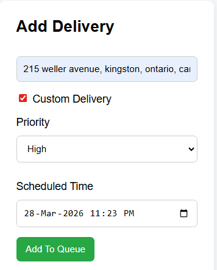
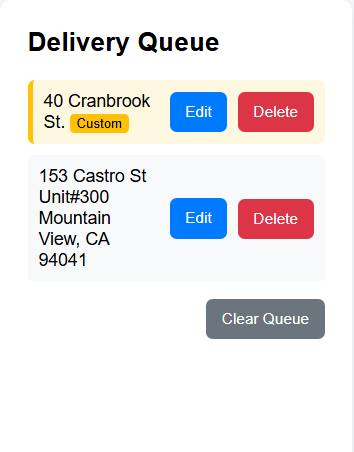
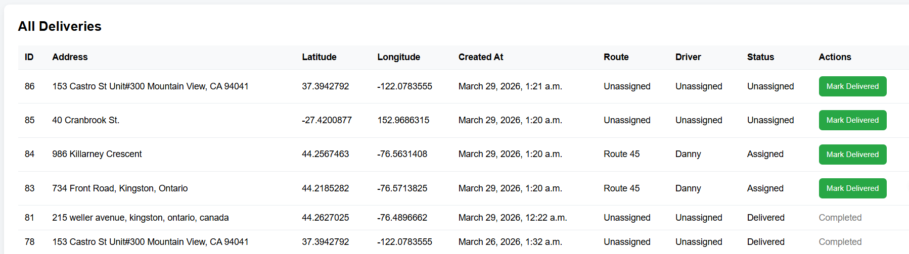
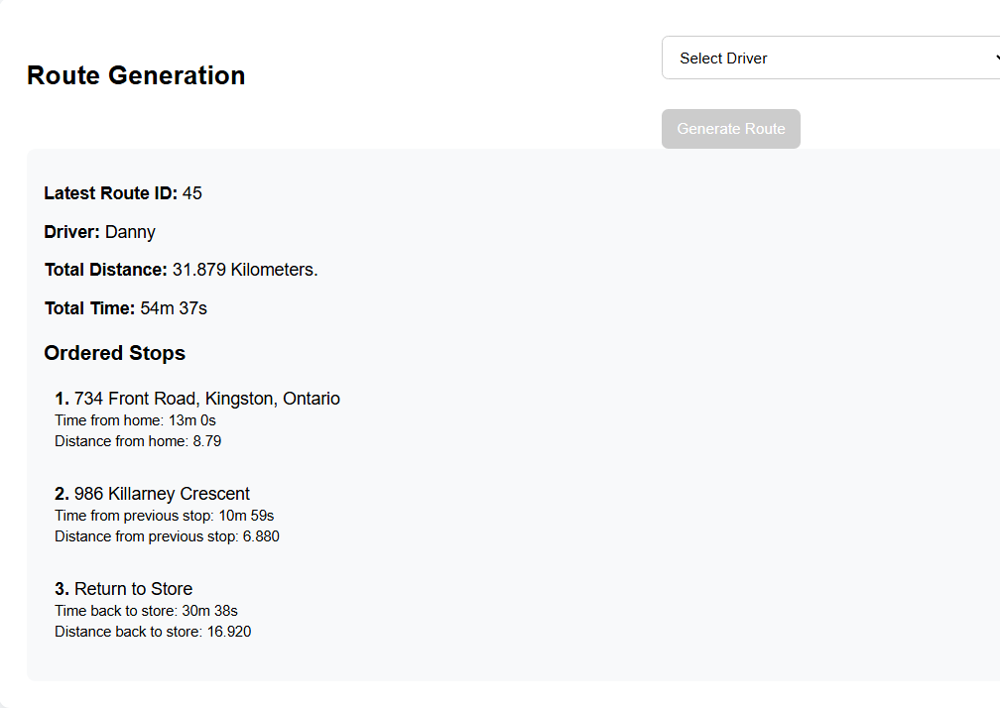
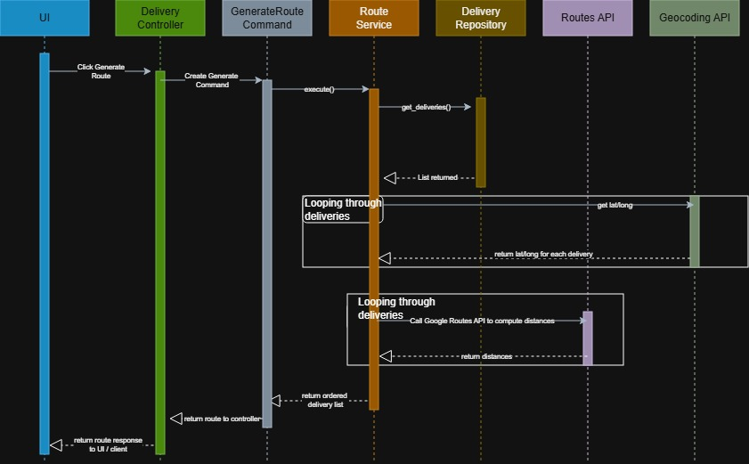

# Delivery Route Optimization System

A Django-based web application for managing delivery queues and generating optimized delivery routes using real-time routing data.

## Overview

This project simulates a delivery management system for small businesses (such as pizzerias) where dispatchers can create deliveries, assign them to drivers, and generate efficient routes.

The system models real-world delivery workflows including queue management, driver assignment, and route optimization and integrates with the Google Routes API to calculate distances and travel times, allowing routes to be built dynamically based on real-world data.

This allows route optimization based on real-world distance and travel time data.

## Screenshots

### Add Delivery


### Delivery Queue


### All Deliveries


### Route Generation


### Route Optimization Flow - Sequence Diagram


## Features

### Delivery Management

* Add deliveries using a human-readable address (automatically geocoded)
* View unassigned and assigned deliveries
* Delete individual deliveries or clear the queue
* Mark deliveries as delivered
* Automatically frees drivers when all deliveries in a route are completed

### Route Generation

* Generates delivery routes using a greedy nearest-neighbor algorithm
* Calculates:

  * Distance between stops
  * Time between stops
  * Total route distance and duration
* Assigns routes to selected drivers
* Prevents assigning routes to drivers already in use

### Driver Management

* Drivers are managed through Django Admin
* Drivers can be selected from a dropdown in the dashboard
* Each driver is assigned a single active route

### Architecture

* Command Pattern used for business operations (e.g., route generation, delivery updates)
* Factory Pattern used for dynamic Delivery object creation
* Repository Pattern used for database interaction
* Separation of concerns between:

  * Views (request handling)
  * Services (routing and geocoding logic)
  * Commands (application actions)
  * Models (data layer)

## Tech Stack

* Backend: Django (Python)
* Database: MySQL (Google Cloud SQL via proxy)
* API: Google Routes API
* Frontend: Django Templates + CSS
* Libraries:

  * requests
  * geocoder
  * polyline
  * python-dotenv

## Project Structure

```text
delivery_manager/
├── myproject/
│   ├── deliverymanager/        # Main application
│   │   ├── commands/           # Command pattern logic
│   │   ├── repositories/       # Data access layer
│   │   ├── services/           # Routing and geocoding services
│   │   ├── templates/          # HTML templates
│   │   ├── static/             # CSS and JavaScript
│   │   ├── templatetags/       # Custom template filters
│   │   ├── models.py
│   │   ├── views.py
│   │   └── urls.py
│   ├── myproject/              # Django configuration
│   │   ├── settings.py
│   │   ├── urls.py
│   │   ├── asgi.py
│   │   └── wsgi.py
│   ├── manage.py
│   ├── requirements.txt
│   └── start.ps1
└── README.md
```

## Environment Variables

Create a `.env` file in the project root:

```
ROUTES_API_KEY=your_google_routes_api_key
ROUTES_GROUP_API_URL=https://routes.googleapis.com/distanceMatrix/v2:computeRouteMatrix
```

Quick Setup  

1. Navigate to the project directory

2. Open a terminal

3. Run: .\start.ps1

4. Optional: If you have already stopped and run the program and would like to restart it, 
             and just need to run the proxy you can run .\quick_start.ps1 from the project 
             directory and that will start the proxy.

  

## Setup

1. Clone the repository

```
git clone <your-repo-url>
cd delivery_manager/myproject
```

2. Create a virtual environment

```
python -m venv venv
venv\Scripts\activate
```

3. Install dependencies

```
pip install -r requirements.txt
```

4. Start the Cloud SQL Proxy

```
.\path_to_proxy\cloud-sql-proxy.exe --credentials-file="path/key.json" --port=3306 PROJECT:REGION:INSTANCE
```

5. Run migrations

```
python manage.py migrate
```

6. Create an admin user

```
python manage.py createsuperuser
```

7. Run the server

```
python manage.py runserver
```

## Usage

1. Navigate to `/admin` and create drivers
2. Open the dashboard
3. Add deliveries
4. Select a driver
5. Generate a route
6. View ordered stops and route details
7. Mark deliveries as completed

## Routing Approach

The routing system uses a greedy nearest-neighbor algorithm:

1. Start from the origin location
2. Request distance matrix data from the API
3. Select the closest valid destination
4. Repeat until all deliveries are assigned

Each step stores distance and time between stops, along with total route metrics.

## Notes

* The `proxy/`, `venv/`, and `.env` files are excluded from version control
* A Cloud SQL proxy is required to connect to the database
* The project is structured to emphasize maintainability and separation of concerns

## Author

Danny Beaudoin
Software Engineering Technology, McMaster University